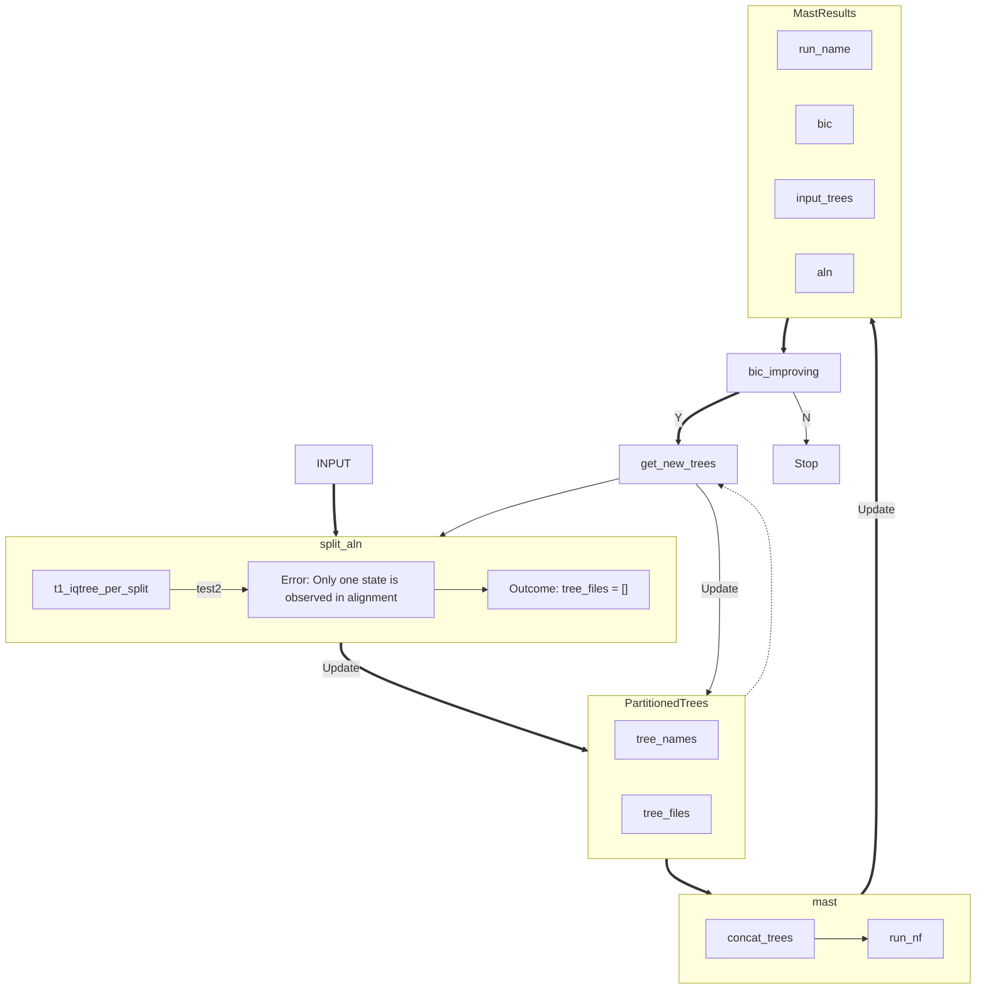

# rec-mast
Recombination detection with mixtures across sites and trees

## Dependencies  
nextflow 22.04.5  
[iqtree 2.2.0.7.mix](https://github.com/iqtree/iqtree2/releases/tag/v2.2.0.7.mx)  
R 4.1.2  
devtools 2.4.3  
[MixtureModelHMM](https://github.com/fredjaya/MixtureModelHMM)  
[AMAS](https://github.com/marekborowiec/AMAS)  

## Installation  

```
git clone https://github.com/fredjaya/rec-mast.git
cd rec-mast
conda env create -f env.yml
conda activate rec-mast
Rscript install_pacakges.R
```

- Install IQ-TREE manually and add symlink to /bin  

## Usage  
Call python3 to ensure conda version is used.  

- Infer the (best number of) topologies from a sequence alignment (`test1.fa`):  
```
python3 run.py -a data/test1.fa -f fasta
```  

- Show all available options:  
```
python3 run.py -h  
```

- Run unit tests (for my own reference):  
```
python3 -m run.py -h  
```

## Workflow  


## Outputs  

## Issues and contributing  

