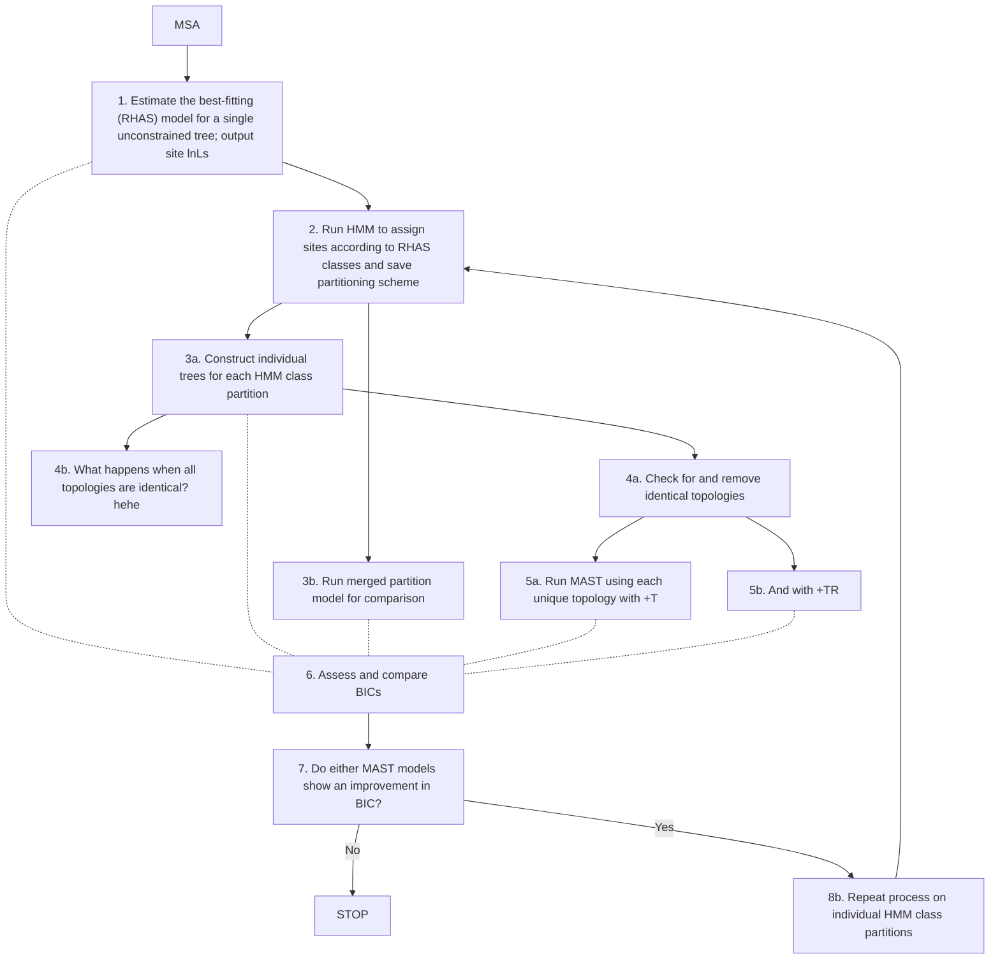

# rec-mast
Recombination detection with mixtures across sites and trees

## Dependencies  
iqtree 2.2.0.7.mix  
R 4.1.2  
devtools 2.4.3  
[MixtureModelHMM](https://github.com/roblanf/MixtureModelHMM)  

## Workflow 

Currently, use RHAS categories to delimit sites for input MAST topologies:  

## Methods to delimit trees  
- Rate heterogeneity classes  
- Site likelihoods  
- sCF  

## Testing and development  

Currently focusing on building a working MVP, utilising the 78 sarbecovirus alignment from Lytras et al. (2022)
